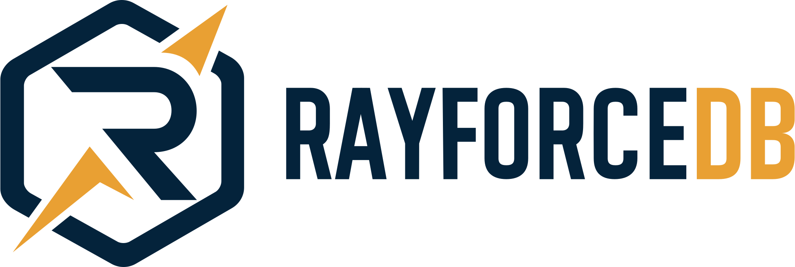

<!--
  Copyright (c) 2025-2026 Anton Kundenko <singaraiona@gmail.com>
  All rights reserved.

  Permission is hereby granted, free of charge, to any person obtaining a copy
  of this software and associated documentation files (the "Software"), to deal
  in the Software without restriction, including without limitation the rights
  to use, copy, modify, merge, publish, distribute, sublicense, and/or sell
  copies of the Software, and to permit persons to whom the Software is
  furnished to do so, subject to the following conditions:

  The above copyright notice and this permission notice shall be included in all
  copies or substantial portions of the Software.

  THE SOFTWARE IS PROVIDED "AS IS", WITHOUT WARRANTY OF ANY KIND, EXPRESS OR
  IMPLIED, INCLUDING BUT NOT LIMITED TO THE WARRANTIES OF MERCHANTABILITY,
  FITNESS FOR A PARTICULAR PURPOSE AND NONINFRINGEMENT. IN NO EVENT SHALL THE
  AUTHORS OR COPYRIGHT HOLDERS BE LIABLE FOR ANY CLAIM, DAMAGES OR OTHER
  LIABILITY, WHETHER IN AN ACTION OF CONTRACT, TORT OR OTHERWISE, ARISING FROM,
  OUT OF OR IN CONNECTION WITH THE SOFTWARE OR THE USE OR OTHER DEALINGS IN THE
  SOFTWARE.
-->

<p align="center">
  <a href="https://sense.rayforcedb.com/">
    
  </a>
</p>

<p align="center">
  <a href="https://crates.io/crates/raysense"></a>
  <a href="https://crates.io/crates/raysense"></a>
  <a href="LICENSE"></a>
  <a href="https://github.com/RayforceDB/raysense/actions/workflows/ci.yml"></a>
  <a href="#agent-integration"></a>
  <a href="https://sense.rayforcedb.com/#languages"></a>
</p>

Raysense reads your repository as a graph: who imports who, where the
cycles are, which files are now load-bearing, what tends to change
together. It runs locally, refreshes on save, and serves the whole
picture to your coding agent over MCP. Before an edit, the agent can
ask *what depends on this file*. After a chunk of edits, it can ask
*did this regress anything*.

## Why

A coding agent reads source one file at a time. The shape of the
project (its modules, its layers, its cycles, the files that always
change together) never reaches its working memory. Reviewers operate
on diffs, and a diff hides structure by definition. So architectural
drift is invisible until it shows up as a production bug, a
regression, or a refactor that takes a week.

## Grading model

Six dimensions, each graded A through F against the dependency graph
and commit history of the repo. The overall score, 0 to 100, is their
weighted aggregate:

- **Modularity** - how cleanly modules separate
- **Acyclicity** - how much the dependency graph really is a graph
- **Depth** - how layered (or how flat-and-tangled) the code is
- **Equality** - how evenly responsibility is distributed
- **Redundancy** - how much logic is duplicated
- **Structural uniformity** - how consistent the patterns are

The score moves with structure, not with cosmetics: adding tests or
shuffling files around will not lift it.

## Install

One-liner. Installs the `raysense` binary and registers it as a stdio MCP
server with whichever local Claude hosts are present (Claude Desktop and / or
the `claude` CLI):

```bash
curl -fsSL https://raw.githubusercontent.com/RayforceDB/raysense/main/install.sh | sh
```

Step by step instead:

```bash
cargo install raysense   # binary only
raysense install         # register raysense with every Claude host present
```

The install command auto-detects every Claude host on the machine and
registers raysense with each one in its native form:

| Host | Where it writes | What you get |
|---|---|---|
| Claude Desktop | `claude_desktop_config.json` | MCP server (50 tools + 6 prompts in the "+" menu) |
| Claude Code | `~/.claude/settings.json` (marketplace + enabledPlugins) | Plugin: tools + prompts + slash commands (`/raysense:audit`) + skills |
| Cowork | `local-agent-mode-sessions/<account>/<device>/cowork_plugins/known_marketplaces.json` | Marketplace registered; finish with `/plugin install raysense@raysense-marketplace` in your next Cowork session |

Force a subset when you want to be explicit:

```bash
raysense install --desktop   # only Claude Desktop
raysense install --code      # only Claude Code (plugin install)
raysense install --cowork    # only Cowork (research preview)
```

Re-running is safe. Existing `raysense` entries are overwritten silently, so
upgrading via `cargo install raysense` and then re-running `raysense install`
points the host at the new binary in one step.

Skip the host wiring if you only want the CLI:

```bash
curl -fsSL https://raw.githubusercontent.com/RayforceDB/raysense/main/install.sh | sh -s -- --no-mcp
```

### Update

To upgrade an existing install to the latest release:

```bash
cargo install raysense --force   # pull the newest binary from crates.io
raysense install                 # repoint every detected host at the new binary
```

Or in one shot via the installer (it also takes `--version` if you want to pin):

```bash
curl -fsSL https://raw.githubusercontent.com/RayforceDB/raysense/main/install.sh | sh
```

For Claude Code, after upgrading the binary also run:

```
/plugin uninstall raysense@raysense-marketplace
/plugin install raysense@raysense-marketplace
```

(or use `/plugin reinstall raysense` if your Claude Code version supports it,
followed by `/reload-plugins`). This pulls the new plugin manifest, slash
commands, and skills from GitHub. The MCP server picks up the new binary
automatically because it's resolved from `PATH` on each launch.

For Cowork, run `/plugin install raysense@raysense-marketplace` in a fresh
Cowork session (the marketplace was registered by `raysense install`; cowork
fetches the plugin on first install).

For Claude Desktop, just **quit and reopen** the app — the MCP server respawns
on launch and the new binary is on PATH from `cargo install --force`.

### Agent surfaces

Once raysense is installed, agents see it through up to four surfaces. Which
ones light up depends on the host:

| Surface | Invoked by | Available in |
|---|---|---|
| **MCP tools** (`raysense_health`, `raysense_hotspots`, `raysense_blast_radius`, …) | The model auto-calls them as needed | Desktop, Code, Cowork |
| **MCP prompts** (templated workflows, parametrized) | Desktop "+" attachment menu / Claude Code `/mcp__raysense__*` | Desktop, Code, Cowork |
| **Plugin slash commands** (`/raysense:*`) | User typing `/` | Code, Cowork |
| **Plugin skills** (model-triggered phase workflows) | The model picks them up automatically when phase-relevant | Code, Cowork |

The six workflow names are consistent across surfaces:

| Name | What it does | Args |
|---|---|---|
| `bootstrap` | Scan, save baseline, surface top hotspots / failing rules | `path` |
| `verify` | Rescan, diff against the session baseline | `path` |
| `drift` | Diff over a time window (7d / 30d / 90d) | `path`, optional `window` |
| `impact` | Blast radius + coupling + cycle exposure for one file | `path`, `file` |
| `query` | Run a Rayfall query (`select` / `.graph.*` / Datalog) against the baseline | `path`, `question` |
| `audit` | Heavy review: architecture, evolution, test gaps, DSM | `path` |

In Claude Code, type `/raysense:audit /path/to/repo` for the slash form, or
let the model invoke the matching skill. In Claude Desktop, click the "+"
attachment button next to the prompt bar, pick `raysense → audit`, and fill in
the path. The MCP tools (50+ of them, listed in `raysense --help` and via
`tools/list`) are always callable directly by the model.

## Use

```bash
raysense .              # health report
raysense . --check      # CI gate, exits non-zero on rule violations
raysense . --watch      # rescan + reprint on a 2s loop
raysense . --ui         # live dashboard at http://localhost:7000
raysense --mcp          # stdio MCP server for agents
```

## Sample output

Pointed at this very repo (`raysense .`):

```text
score 82 / 100
coverage 90 / 100
structure 68 / 100
facts files=34 functions=656 calls=7518 call_edges=1383 imports=247
imports local=98 external=124 system=0 unresolved=25
graph resolved_edges=89 cycles=0 max_fan_in=53 max_fan_out=21
coupling local_edges=98 cross_module_edges=0 god_files=2 unstable_hotspots=0
size max_file_lines=5907 max_function_lines=1345 large_files=7 long_functions=20
test_gap production_files=13 test_files=0 files_without_nearby_tests=13
dimensions modularity=100/100 (A) acyclicity=100/100 (A) depth=100/100 (A)
           equality=45/100 (F) redundancy=80/100 (B) structural_uniformity=79/100 (C)
overall_grade B
architecture depth=4 max_blast_radius=7 max_blast_radius_file=src/facts.rs
complexity max=140 avg=4.261 cognitive_max=119 cognitive_avg=3.457 dead_functions=50
evolution available=true commits_sampled=151 changed_files=34 authors=2 bug_fix_commits=1
```

`--json` produces the same facts in machine-readable form for CI gates,
diffs, and agent consumption. `--ui` brings up the same data live in
the browser, `--watch` keeps the terminal report fresh as you edit, and
`--mcp` exposes every fact and rule to your coding agent over MCP.

## Query and policy

Every saved baseline is a queryable columnar database. Run free-form
Rayfall expressions, drop in custom rules as `.rfl` files, and bring
external CSVs into the same query substrate.

```bash
# 1. Save a baseline with 21 splayed tables (files, functions, calls,
#    call_edges, imports, types, hotspots, change_coupling,
#    trend_health, trend_hotspots, trend_violations, ...)
raysense baseline save .

# 2. Ad-hoc query in Rayfall (LISP-like, prefix, arity-strict).
raysense baseline query files \
    '(select {from: t where: (> lines 500) desc: lines})'

# 3. Graph algorithms over the call graph (PageRank, Louvain, topsort,
#    shortest-path, betweenness, k-shortest, BFS expand).
raysense baseline query call_edges \
    '(select {from: (.graph.pagerank
                      (.graph.build t (quote caller_function)
                                      (quote callee_function))
                      30 0.85)
              desc: _rank take: 10})'

# 4. CI-gated architectural rules. Drop *.rfl files in
#    .raysense/policies/; each must return a (severity, code, path,
#    message) table. Exit code 0 pass, 1 eval error, 2 error finding.
raysense policy check

# 5. Bring your own data. Coverage, lints, runtime traces,
#    pre-computed embeddings -- all join the baseline through the
#    shared sym table.
raysense baseline import-csv coverage ./coverage.csv
raysense baseline query coverage \
    '(select {from: t where: (< covered_pct 50)})'
```

See [`examples/`](examples/) for starter policies and sample data.
Full Rayfall syntax (select / `.graph.*` / Datalog / vector search)
ships as the `query` skill bundled with the plugin (`/raysense:query`).

## Agent integration

Raysense ships as a Claude Code plugin:

```text
/plugin marketplace add RayforceDB/raysense
/plugin install raysense
```

Six skills: scan + baseline at session start, blast radius before
edits, regression diff after, on-demand architecture audits,
time-window drift detection ("what got worse over the last 30 days"),
and a Rayfall query skill that lets agents run free-form expressions
against the saved baseline tables when the typed tools fall short.
Multi-codebase isolation is cwd-driven, so per-project state stays in
`<repo>/.raysense/`. Two sessions on two repos = two independent
baselines, zero cross-project bleed.

## Capabilities

- **Live treemap dashboard** - every file, every metric, every cycle,
  open in your browser while you work
- **Baselines and what-if** - diff against a saved snapshot; simulate
  an edit (delete a file, break a cycle) before touching the tree
- **Splayed-table agent memory** - scan results materialized as
  columnar tables so an agent's follow-up questions are instant
  reads, not re-scans
- **Rayfall query layer** - run select / `.graph.*` (PageRank,
  Louvain, topsort, shortest-path, betweenness, ...) / Datalog rules
  with transitive closure / vector primitives (cos-dist, knn,
  hnsw-build, ann) against the saved tables. Same vocabulary in
  agent queries, MCP tools, and committed `.rfl` policy packs
- **Policy packs as code-reviewable files** - `.raysense/policies/*.rfl`
  are Rayfall expressions that return a (severity, code, path,
  message) table. `raysense policy check` walks the directory and
  exits 0 / 1 / 2 for CI gating. Architectural rules ship in the
  repo, not in raysense's release notes
- **Bring your own data** - `raysense baseline import-csv` lifts any
  CSV into a queryable baseline table. Coverage data, lint counts,
  runtime traces, pre-computed embeddings -- all join the structural
  baseline through the shared sym table
- **Edit-risk per file** - one number per file ranking which the next
  agent edit is most likely to break. Composite of churn, max
  complexity, single-owner penalty, and missing-tests penalty,
  refreshed on every save
- **Drift over time** - every baseline save and `trend record`
  appends one row to the splayed `trend_health`, `trend_hotspots`,
  and `trend_violations` tables in the saved baseline. Agents query
  "what got worse over the last 30 days" through Rayfall, the typed
  `raysense_drift` MCP tool, or the `drift` skill, all reading the
  same columnar substrate as every other baseline table. No JSON
  sidecar. Verify still surfaces per-dimension regressions against
  the saved baseline (Equality B to D) for the no-time-window case
- **Bug-density per file** - files where most of the churn is fix
  commits float to the top. Conventional Commits prefixes (fix,
  hotfix, revert) drive the classifier; absolute count and ratio
  against total commits both feed the ranking
- **Test gap detection** - files without nearby tests, ranked by
  structural risk. Feeds directly into the edit-risk score so
  untested files in churn-heavy areas surface first
- **Evolution signal** - bus factor per file, change-coupling pairs,
  temporal hotspots (churn x complexity), file age windows, and
  bug-fix concentration over the last 500 commits
- **69 language profiles out of the box** - 11 languages with full
  AST analysis (Python, TypeScript, C++, Java, C#, Kotlin, Scala,
  Swift, Ruby get type inheritance on top; Rust and C stop at
  complexity since their type models don't fit the inheritance
  graph). Rayfall (the RayforceDB query language) ships with native
  function/import/type extraction tuned to its S-expression syntax.
  57 more standard profiles (Go, Elixir, Haskell, Clojure, Zig,
  GLSL, Terraform, Dockerfile, ...) via configurable plugins. Add
  your own in `.raysense/plugins/`.

## Built on Rayforce

<a href="https://github.com/RayforceDB/rayforce">
  <picture>
    <source media="(prefers-color-scheme: dark)" srcset="docs/logo-light.svg">
    <source media="(prefers-color-scheme: light)" srcset="docs/logo-dark.svg">
    
  </picture>
</a>

The splayed-table agent memory, the baseline tables you can query
back, and the columnar storage behind the live dashboard are all
powered by **[Rayforce](https://github.com/RayforceDB/rayforce)**, an
in-memory analytics runtime optimized for graph-shaped queries.
Rayforce is what makes "ask the same question a hundred times during
a coding session" cost a hundred microseconds instead of a hundred
re-scans. It's open-source and linked statically into the raysense
binary; there is nothing extra to install.

If you're building structural-analysis tooling of your own, take a
look. Rayforce is a standalone project and useful well beyond this
one.

## Configuration

`.raysense.toml` at the repo root overrides everything: rule
thresholds, plugin language definitions, baseline scoring, what-if
ignored paths. Per-language rule overrides let one language demand
stricter caps than another. `raysense --help` lists every flag.

## Building from source

```bash
git clone https://github.com/RayforceDB/raysense.git
cd raysense
cargo build --release
```

The rayforce C runtime is sourced from upstream at the SHA pinned in
`.rayforce-version`. `build.rs` clones it on first build, or uses a
`RAYFORCE_DIR=/abs/path` you provide. Requires `git`, `make`, and a C
compiler (clang or gcc).

## License

MIT. See [LICENSE](LICENSE).
